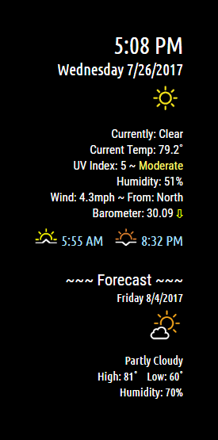
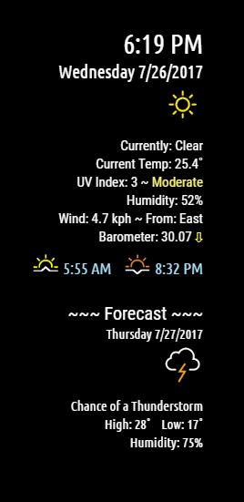
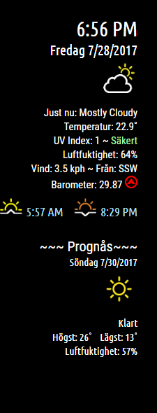

# MMM-NOAA

**Weather for your mirror**

## Examples

, , 

## Your terminal installation instructions

* `git clone https://github.com/cowboysdude/MMM-NOAA` into the `~/MagicMirror/modules` directory.

* Run `npm install` in the `~MagicMirror/modules/MMM-NOAA` directory.

## Get your free API key here

https://www.wunderground.com/weather/api

* Select the middle plan

## Get your PWS from here

 https://www.wunderground.com/wundermap
 
 * For your config.js entry for precise localized weather 

## Config.js entry and options

Will automatically select translation file and either F or C by reading your defaults from the config.js file [at the top]
Will default to EN if NO translation file is found.

    {
        disabled: false,
        module: 'MMM-NOAA',
        position: 'top_right',
        config: {
            apiKey: "YOUR API KEY",          // https://www.wunderground.com/weather/api  select the middle plan... 
			maxWidth: "100%",        // Suggest leaving it at 100%
			pws: "KNYELMIR13",       // go here to find your pws: https://www.wunderground.com/wundermap
			lat: "42.089796",        // need this for sunrise/sunset  if left blank none will show  -- find them here: http://www.latlong.net/
			lon: "-76.807734",       // need this for sunrise/sunset  if left blank none will show
			format: "12",             // 12 or 24 hour format.. will default to 12 hour if none selected.
			rotateInterval: 10 * 1000,  // Every 10 seconds 
			ampm: true,                 //to show AM and PM on Sunrise/Sunset times
                        showClock: true,            //Hides or shows clock
			dformat: "1"                //Date format 1 for D/M/Y 2 for M/D/Y
	}
    },
	
## Start your mirror . . . enjoy!  [Relax... it will take a minute to load this module!]
