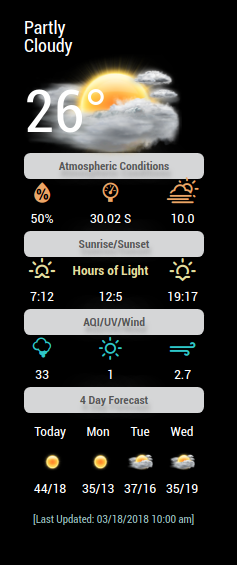

# MMM-NOAA

**Weather for your mirror**
  Also UV index and Air Quality Index.  [Warning AQI may not work in all areas if not you won't be able to use this branch].

## Examples

If you do not enter a name in the config.js file it will just say either "Good Morning", "Good Afternoon" or "Good Evening".  With a name.  
   *Config options trimmed to just three!
   *NO longer need to enter Lat and Lon... it's automatic!
   *Automatically adjusts languge based on your config.js!

## Your terminal installation instructions

* `git clone https://github.com/cowboysdude/MMM-NOAA2` into the `~/MagicMirror/modules` directory.
*  `~MagicMirror/modules/MMM-NOAA2`
*  `npm install`

## Get your free API key here [WEATHER, You must also get an AirAPI Key--- see below]

 [https://www.wunderground.com/weather/api](https://www.wunderground.com/weather/api)

* Select the middle plan

## Get your PWS from here

 [https://www.wunderground.com/wundermap](https://www.wunderground.com/wundermap)
 
* For your config.js entry for precise localized weather 

## Get your AirKEY from here

 [https://airvisual.com/api](https://airvisual.com/api)

## Config.js entry and options

Will automatically select translation file and either F or C by reading your defaults from the config.js file [at the top]
Will default to EN if NO translation file is found.  Weather alerts will be in the native language chosen by your config.js automatically and in the correct language!  Thanks tbbear!!! [Need to fix this for this branch]

    {
        disabled: false,
        module: 'MMM-NOAA',
        position: 'top_right',
        config: {

		apiKey: "YOUR API KEY",    // https://www.wunderground.com/weather/api  select the middle plan... 	 
		airKey: "YOUR API KEY",    // IF you want Air Quality Index
		pws: "KNYELMIR13",         // go here to find your pws: https://www.wunderground.com/wundermap		 
	}
    },

## Start your mirror . . . enjoy! 
