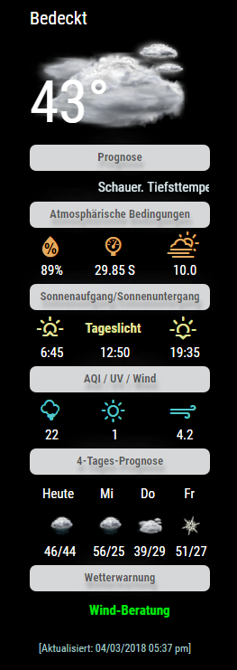
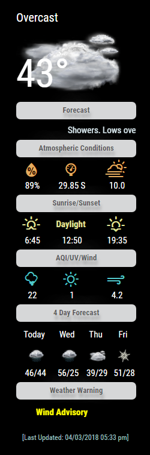
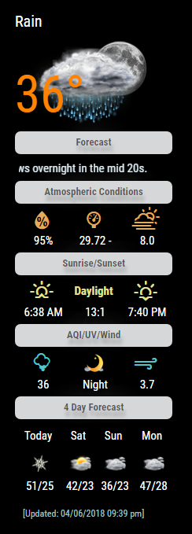

This repository is maintained by Cowboysdude and is the Original NOAA module... [SPECIAL THANKS TO tbbear FOR FOR ALL THE HARD WORK!]
[This is the second version of this module for MagicMirror2]

# MMM-NOAA V2.0

**Weather for your mirror**
  Also UV index and Air Quality Index.  [Warning AQI may not work in all areas].

## Examples

    

*Automatically adjusts languge and all other settings based on your config.js!

## Your terminal installation instructions

* `git clone https://github.com/cowboysdude/MMM-NOAA` into the `~/MagicMirror/modules` directory.
*  `~MagicMirror/modules/MMM-NOAA`
*  `npm install`

## Get your free API key here [WEATHER, You must also get an AirAPI Key--- see below]

 [https://www.weatherbit.io/api](https://www.weatherbit.io/api)

* Select the free plan

## Get your AirKEY from here

 [https://airvisual.com/api](https://airvisual.com/api)

## Config.js entry and options

Will automatically select translation file and either F or C by reading your defaults from the config.js file [at the top]
Will default to EN if NO translation file is found.  Weather alerts will be in the native language chosen by your config.js automatically and in the correct language!  Thanks tbbear!!!
In this new Version you can select up to 3 different weather locations like in this example. You can also show up names(the one u like) for this places.
U can do the selection of the location my pressing on the city name on touchscreen, with mouse-click or mousepad. 

    {
        module: 'MMM-NOAA',
        config: {

		apiKey: "YOUR API KEY",    // https://www.wunderground.com/weather/api  select the middle plan... 
		airKey: "YOUR API KEY"    // IF you want Air Quality Index
	}
    },

## Start your mirror . . . enjoy! 
